# SHENZHEN HIVIEW SCIENCE AND TECHNOLOGY CO., LTD.
## This shows a program structure that can be compiled and run. See README.TXT
## We provide hisilicon chip solutions with hardware customization and software services to support customers' rapid product development.
## Business cooperation, contact Email: thomas@hiview-tech.cn
## RoadMap:
### 1. Design products in the form of core board + extension board (customizable);
### 2. Continue to increase the function development of Openhisilicon project;
### 3. Finally complete the open product, users can run their own programs (based on Openhisilicon);

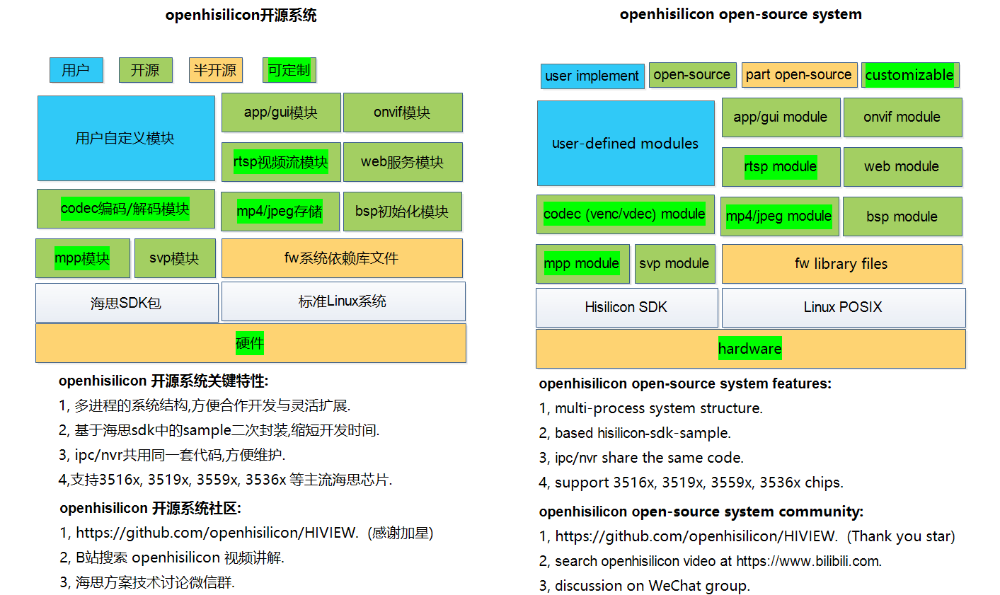
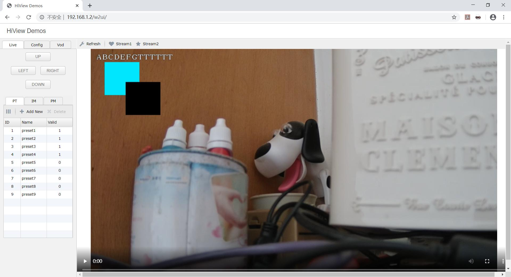
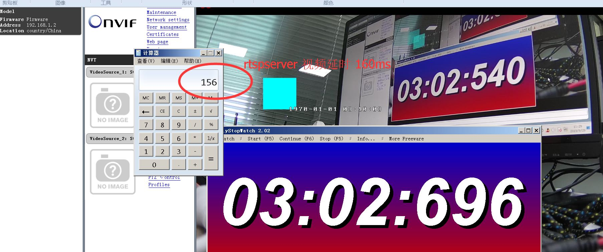
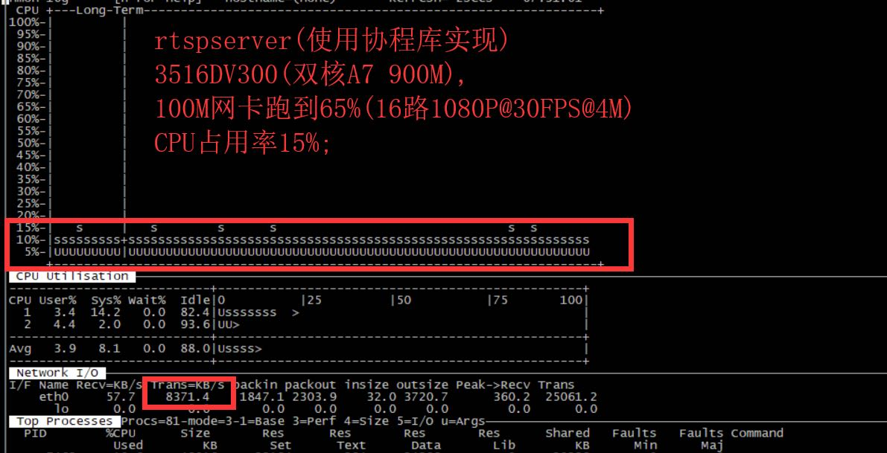
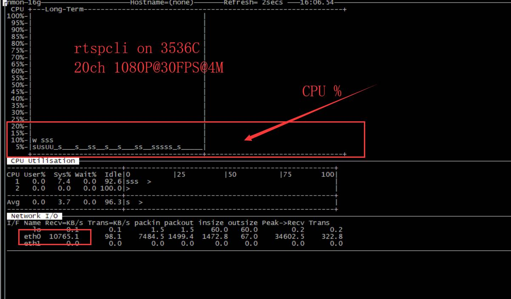
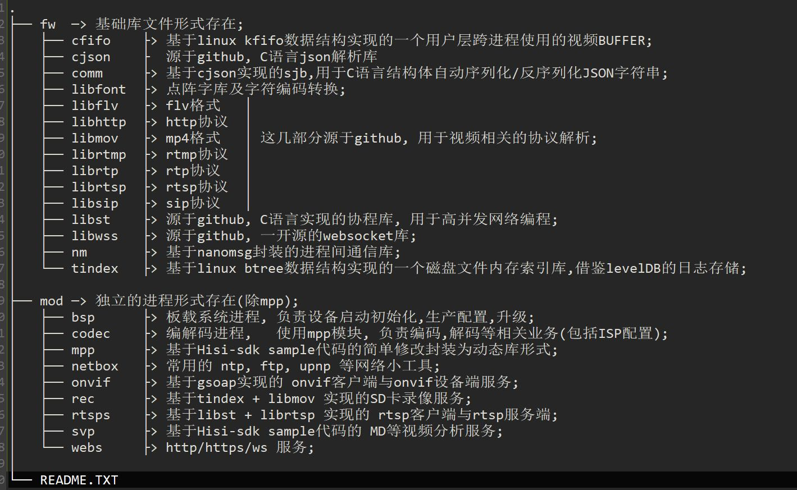
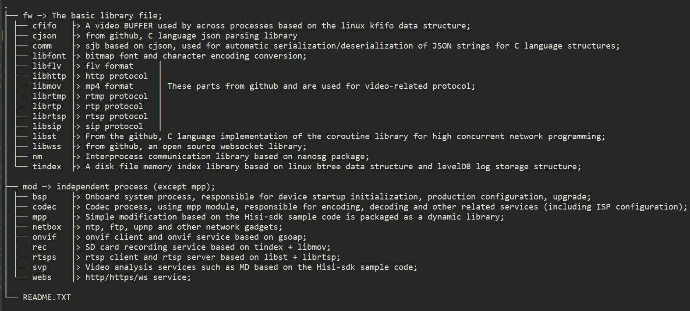
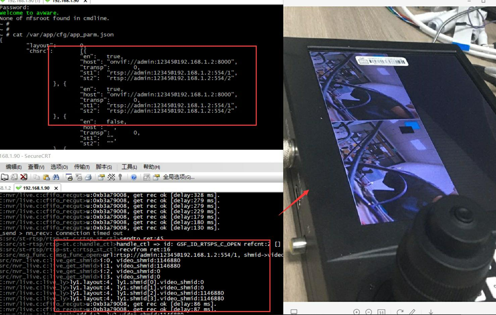
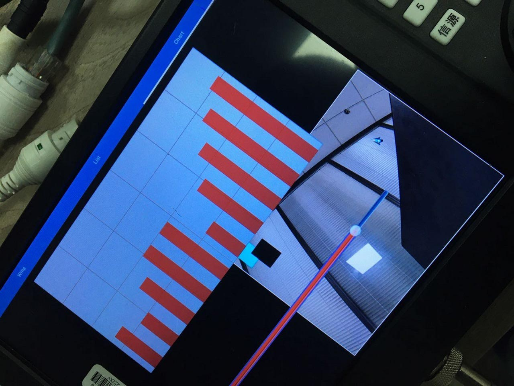
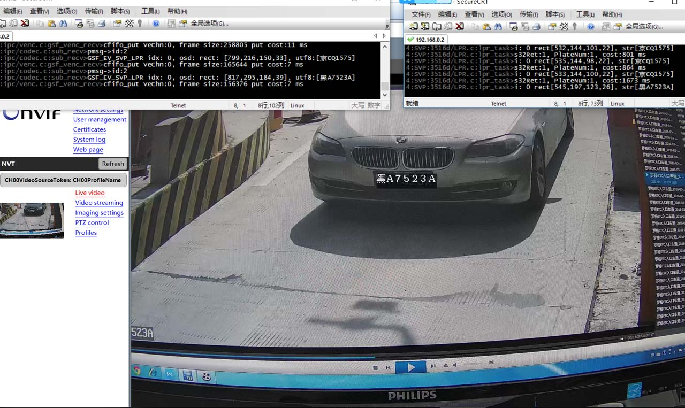
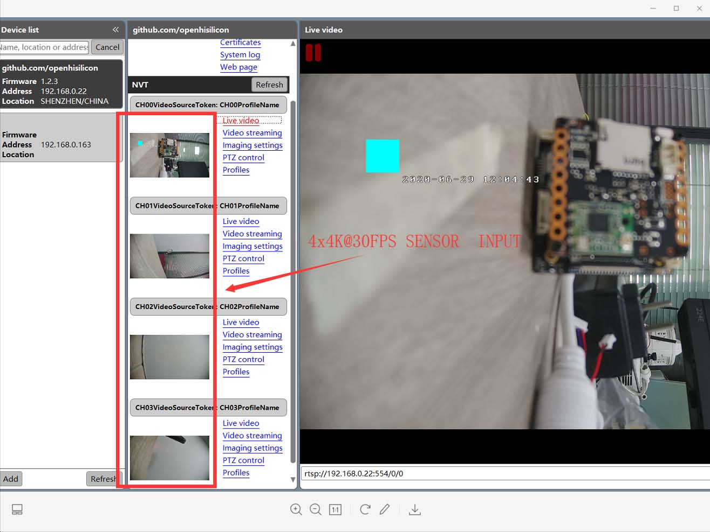
